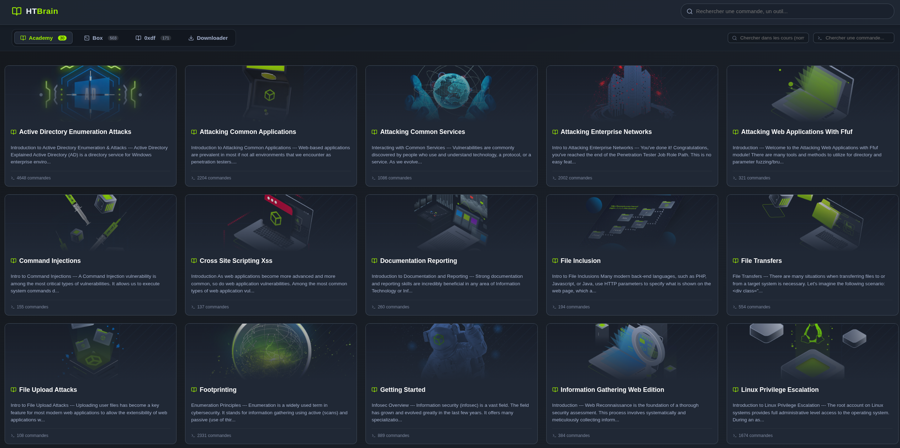

# HTBrain



Personal knowledge hub for HackTheBox content. Aggregates HTB Academy modules, official machine writeups, and 0xdf community writeups into a unified local web viewer with search, filtering, and a download manager.

---

## Structure

```
htb_parser-main/
├── htb_next_viewer/               # Main web app (Next.js + Python auth server)
├── htb_academy_module_downloader/ # Go tool - download HTB Academy modules -> Markdown
├── htb_official_box_writeups_downloader/ # Python - download official HTB writeups (PDF -> Markdown)
├── htb_0xdf_writeups_downloader/  # Python - scrape 0xdf.gitlab.io writeups
├── data/                          # Downloaded content (git-ignored)
│   ├── HTB_Modules/
│   ├── HTB_official_box_writeups/
│   └── HTB_0xdf_box_writeups/
├── runtime/                       # Cache & logs (git-ignored)
└── start.sh                       # Launcher for the web app
```

---

## Web Viewer - `htb_next_viewer`

### Requirements

- Node.js 18+
- Python 3+ with `undetected-chromedriver` (`pip install -r htb_next_viewer/requirements.txt`)
- Chromium

### Start

```bash
# Foreground (port 3000)
./start.sh

# Background
./start.sh -b

# Custom port
./start.sh -p 3001

# Background management
./start.sh --status
./start.sh --logs
./start.sh --stop
```

Then open [http://localhost:3000](http://localhost:3000).

### Features

**Three content sources:**
- **Academy** - HTB Academy training modules (Markdown, with images)
- **Box** - Official HTB machine writeups + 0xdf community writeups
- **Downloader** - In-app download manager for Academy modules

**Viewer:**
- Full-text fuzzy search across all content
- Difficulty / OS filters for box writeups
- Command extraction from code blocks
- Tabbed view: content / walkthrough
- Syntax-highlighted code blocks with copy button

**Download Manager:**
- Login via Chrome (Cloudflare bypass via `undetected_chromedriver`)
- Load modules from current enrolled path or dashboard
- Cache-first loading, force reload option
- Selective module download with progress and live logs


## Downloaders

### HTB Academy Modules - Go

```bash
cd htb_academy_module_downloader
./htb-academy-to-md --module <id> --output ../data/HTB_Modules
```

Fetches module HTML from HTB Academy and converts to GFM Markdown. Optionally downloads images locally.

### Official HTB Writeups - Python

```bash
cd htb_official_box_writeups_downloader
python htb_writeup_scraper.py --all --output ../data/HTB_official_box_writeups
```

Requires an HTB App Token in `~/.htb_client/config.json`. Downloads PDFs from the HTB API and converts them to Markdown via `pymupdf4llm`.

```bash
# Single machine
python htb_writeup_scraper.py --machine "Forest"

# Range
python htb_writeup_scraper.py --range 1-100

# Force re-download
python htb_writeup_scraper.py --all --force
```

### 0xdf Writeups - Python

```bash
cd htb_0xdf_writeups_downloader
python 0xdf_scraper.py --output ../data/HTB_0xdf_box_writeups
```

Scrapes writeups from [0xdf.gitlab.io](https://0xdf.gitlab.io), converts to Markdown, and downloads images.

---

## Tech Stack

| Layer | Tech |
|---|---|
| Frontend | React 19, Next.js 16, Tailwind CSS 4 |
| Markdown | react-markdown, remark-gfm, rehype-raw |
| Search | fuzzysort |
| Auth / Browser | undetected_chromedriver (Python), Selenium |
| Academy Downloader | Go, html-to-markdown |
| Box Writeups | Python, pymupdf4llm, requests |
| 0xdf Scraper | Python, html2text, BeautifulSoup |

---

## Roadmap

- [ ] Add 0xdf writeups downloader to the web interface
- [ ] Add official writeups downloader to the web interface
- [ ] List all available modules on the HTB Academy platform
